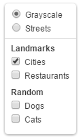
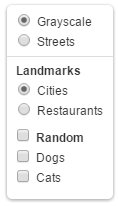

leaflet-groupedlayercontrol
===========================

Leaflet layer control with support for grouping overlays together.
Also supports making groups exclusive (radio instead of checkbox).

> This project is looking for a maintainer. Interested? Open an issue.



Demos: [Basic](http://ismyrnow.github.io/leaflet-groupedlayercontrol/example/leaflet-v1/basic.html) |
[Advanced](http://ismyrnow.github.io/leaflet-groupedlayercontrol/example/leaflet-v1/advanced.html)

## Installation

Install via npm:

```bash
npm install leaflet-groupedlayercontrol
```

> **Note:** This installs v0.x which works with Leaflet 1.x (stable). For Leaflet 2.x (alpha), use: `npm install leaflet-groupedlayercontrol@next`

### Using with a bundler (Vite, Webpack, etc.)

```javascript
import { GroupedLayers } from 'leaflet-groupedlayercontrol';
import 'leaflet-groupedlayercontrol/dist/leaflet.groupedlayercontrol.min.css';
```

### Using in the browser without a bundler

Include the CSS in your HTML `<head>`:

```html
<link rel="stylesheet" href="path/to/leaflet.groupedlayercontrol.min.css" />
```

Then import the JavaScript module:

```javascript
import { GroupedLayers } from './path/to/leaflet.groupedlayercontrol.min.js';
```

## Usage

### Leaflet v2 (Alpha) - ESM Syntax

Import the control and create grouped overlays:

```javascript
import { Map, TileLayer, LayerGroup } from 'leaflet';
import { GroupedLayers } from 'leaflet-groupedlayercontrol';

const groupedOverlays = {
  "Landmarks": {
    "Motorways": motorways,
    "Cities": cities
  },
  "Points of Interest": {
    "Restaurants": restaurants
  }
};

new GroupedLayers(baseLayers, groupedOverlays).addTo(map);
```

#### Advanced usage

For added functionality, pass options when creating the layer control.

```javascript
const options = {
  // Make the "Landmarks" group exclusive (use radio inputs)
  exclusiveGroups: ["Landmarks"],
  // Show a checkbox next to non-exclusive group labels for toggling all
  groupCheckboxes: true
};

const layerControl = new GroupedLayers(baseLayers, groupedOverlays, options);
map.addControl(layerControl);
```



#### Adding a layer

Adding a layer individually works similarly to the default layer control,
except that you can also specify a group name, along with the layer and layer name.

```javascript
layerControl.addOverlay(cities, "Cities", "Landmarks");
```

### Leaflet v1 - Classic Syntax

Add groupings to your overlay layers object, and swap out the default layer
control with the new one.

```javascript
var groupedOverlays = {
  "Landmarks": {
    "Motorways": motorways,
    "Cities": cities
  },
  "Points of Interest": {
    "Restaurants": restaurants
  }
};

L.control.groupedLayers(baseLayers, groupedOverlays).addTo(map);
```

#### Advanced usage

For added functionality, pass options when creating the layer control.

```javascript
var options = {
  // Make the "Landmarks" group exclusive (use radio inputs)
  exclusiveGroups: ["Landmarks"],
  // Show a checkbox next to non-exclusive group labels for toggling all
  groupCheckboxes: true
};

L.control.groupedLayers(baseLayers, groupedOverlays, options).addTo(map);
```

#### Adding a layer

```javascript
layerControl.addOverlay(cities, "Cities", "Landmarks");
```

## Note

This plugin only affects how the layers are displayed in the layer control,
and not how they are rendered or layered on the map.

Grouping base layers is not currently supported, but adding exclusive layer
groups is. Layers in an exclusive layer group render as radio inputs.

## License

leaflet-groupedlayercontrol is free software, and may be redistributed under
the MIT-LICENSE.
